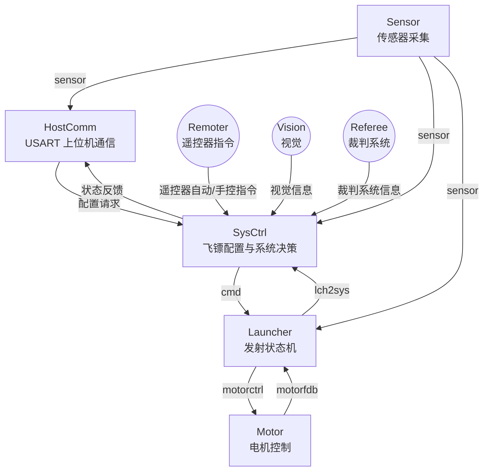

# 下位机代码架构

```mermaid
flowchart TB

    HostComm[HostComm<br/>USART 上位机通信]
    SysCtrl[SysCtrl<br/>飞镖配置与系统决策]
    Launcher[Launcher<br/>发射状态机]
    Motor[Motor<br/>电机控制]
    Sensor[Sensor<br/>传感器采集]
    Remoter((Remoter<br/> 遥控器指令))
    Vision((Vision<br/> 视觉))
    Referee((Referee<br/> 裁判系统))

	Remoter --> |遥控器自动/手控指令| SysCtrl
	Vision --> |视觉信息| SysCtrl
	Referee --> |裁判系统信息| SysCtrl
    HostComm -->|配置请求| SysCtrl
    SysCtrl -->|状态反馈| HostComm
%%     Launcher -->|状态反馈| HostComm %%
    Sensor -->|sensor| HostComm

    SysCtrl -->|cmd| Launcher
%%     SysCtrl -->|visiontx| HostComm %%
    
    Sensor -->|sensor| SysCtrl
    Sensor -->|sensor| Launcher

    Launcher -->|motorctrl| Motor
    Launcher -->|lch2sys| SysCtrl
    
    Motor -->|motorfdb| Launcher

   

   
```